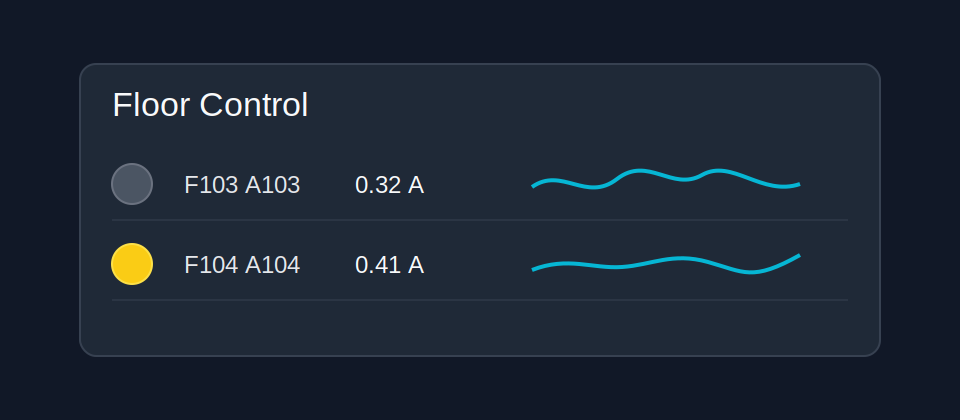

# Table State Card

Table State Card is a compact Home Assistant Lovelace table for repeated rows of controls, values, and small history sparklines.

It is intended for dense operational views where stock entity rows, graph cards, and stacks use too much padding.

## Preview



## Installation

### HACS

1. Open HACS in Home Assistant.
2. Add this repository as a custom repository:

```text
https://github.com/stewartoallen/table-state-card
```

3. Select category **Dashboard**.
4. Install **Table State Card**.
5. Refresh the browser.

HACS should add the dashboard resource automatically. If you need to add it manually, use:

```text
/hacsfiles/table-state-card/table-state-card.js
```

Resource type:

```text
JavaScript module
```

### Manual Install

Copy `table-state-card.js` into:

```text
/config/www/community/table-state-card/table-state-card.js
```

Add this dashboard resource:

```text
/local/community/table-state-card/table-state-card.js
```

Resource type:

```text
JavaScript module
```

Then refresh the browser.

## Example

```yaml
type: custom:table-state-card
title: Zones
hours_to_show: 6
refresh_interval: 300
row_height: 26
column_span: 2
decimals: 1
sparkline_decimals: 1
resolution_minutes: 5
columns:
  - type: toggle
    key: fan
    width: 24px
  - type: name
    width: minmax(80px, 1fr)
  - type: value
    key: temperature
    width: 64px
    decimals: 0
  - type: sparkline
    key: temperature
    width: minmax(90px, 1.4fr)
    hours_to_show: 12
    min: 65
    max: 80
entities:
  - entity: switch.office_fan
    name: Office
    fan: switch.office_fan
    temperature: sensor.office_temperature
  - entity: switch.bedroom_fan
    name: Bedroom
    fan: switch.bedroom_fan
    temperature: sensor.bedroom_temperature
```

## Options

| Option | Type | Default | Description |
| --- | --- | --- | --- |
| `entities` | list | required | Entity rows. Strings are treated as `{ entity }`. |
| `columns` | list | `toggle`, `name`, `value`, `sparkline` | Column definitions as strings or objects with `type` and optional `width`. |
| `title` | string | none | Card title. Omit to hide. |
| `hours_to_show` | number | `6` | Sparkline history range in hours. |
| `refresh_interval` | number | `300` | Seconds between history refreshes. |
| `row_height` | number/string | `28` | Row height in pixels, or any CSS size. |
| `decimals` | number | none | Global decimal places for numeric value columns and sparkline hover values. |
| `sparkline_decimals` | number | `decimals` | Global decimal places for sparkline hover values. |
| `resolution_minutes` | number | `0` | Global sparkline averaging interval in minutes. `0` uses raw history samples. |
| `bucket_minutes` | number | `0` | Alias for `resolution_minutes`. |
| `recorder` | boolean | `true` | Use Home Assistant recorder statistics for eligible sparkline entities when `resolution_minutes` matches a statistics period. Falls back to raw history. |
| `column_span` | number | none | Suggested Home Assistant section-grid column span. |
| `view_layout` | object | none | Optional HA/layout-card layout options such as `grid-column`. |
| `entities[].entity` | string | none | Main row entity. Used for toggle/value/history unless overridden. |
| `entities[].name` | string | friendly name | Display name. |
| `entities[].toggle_entity` | string | `entity` | Entity toggled by the toggle column. |
| `entities[].value_entity` | string | `entity` | Entity displayed by the value column. |
| `entities[].history_entity` | string | `value_entity`/`entity` | Entity used for sparkline history. |
| `entities[].decimals` | number | global | Row-level decimal places for numeric value columns. |
| `entities[].sparkline_decimals` | number | global | Row-level decimal places for sparkline hover values. |
| `entities[].<key>_decimals` | number | row/global | Decimal places for a keyed sparkline/value entity such as `temperature_decimals`. |
| `entities[].hours_to_show` | number | global | Row-level sparkline history range in hours. |
| `entities[].resolution_minutes` | number | global | Row-level sparkline averaging interval in minutes. |
| `entities[].recorder` | boolean | global | Row-level recorder statistics override for sparkline history. |
| `entities[].<key>` | string | none | Named entity reference used by a column with matching `key`, `name`, or `id`. |
| `entities[].color` | string | theme primary | Sparkline stroke color. |
| `entities[].fill` | string | theme primary tint | Sparkline fill color. |

## Columns

Supported column types:

- `toggle`: compact toggle button using `homeassistant.toggle`
- `name`: row label
- `value` or `state`: current state with unit
- `sparkline` or `history`: compact SVG sparkline from history, with hover values

Each column can specify a CSS grid width:

```yaml
columns:
  - type: toggle
    width: 24px
  - type: value
    width: max-content
    decimals: 1
  - type: sparkline
    width: minmax(90px, 1fr)
    sparkline_decimals: 1
    hours_to_show: 12
    resolution_minutes: 5
    recorder: true
    min: 65
    max: 80
    min_color: "#2563eb"
    color_72: "#22c55e"
    color_76: "#facc15"
    max_color: "#dc2626"
```

For numeric displays, `decimals` can be set globally, on a row, or on a column. The global value applies to value cells and sparkline hover values. More specific row or column settings take priority.

For keyed row entities, use `<key>_decimals` when different columns in the same row need different precision:

```yaml
columns:
  - type: value
    key: amps
  - type: sparkline
    key: temperature
entities:
  - name: Floor
    amps: sensor.floor_current
    temperature: sensor.floor_temperature
    amps_decimals: 2
    temperature_decimals: 1
```

Sparkline range and resolution can be set globally, on a row, or on a sparkline column:

```yaml
hours_to_show: 24
resolution_minutes: 15
columns:
  - type: sparkline
    key: watts
    hours_to_show: 6
    resolution_minutes: 5
```

`hours_to_show` controls the visible sparkline span. `resolution_minutes` averages raw history samples into fixed time buckets before drawing and before hover lookup.

When `recorder` is enabled, `resolution_minutes: 5`, `15`, or `30` tries Home Assistant 5-minute recorder statistics first. `resolution_minutes: 60` tries hourly statistics. Entities without recorder statistics fall back to raw history automatically.

Sparkline columns can set `min` and/or `max` to fix the vertical range for that column:

```yaml
columns:
  - type: sparkline
    key: temperature
    min: 65
    max: 80
```

Sparkline columns can also render as a compact color timeline instead of a line by setting both `min_color` and `max_color`. The colors map to the column's `min` and `max` values, or to the automatic data range when `min`/`max` are omitted. Hover behavior stays the same.

```yaml
columns:
  - type: sparkline
    key: temperature
    min: 65
    max: 80
    min_color: "#2563eb"
    color_72: "#22c55e"
    color_76: "#facc15"
    max_color: "#dc2626"
```

Additional `color_<number>` keys add optional interpolation stops between the endpoints. Endpoint colors are still required to enable color timeline rendering.

Columns can resolve entities several ways. The most flexible pattern is to give a column a `key` and put matching entity IDs on each row:

```yaml
columns:
  - type: toggle
    key: fan
  - type: value
    key: temperature
  - type: sparkline
    key: temperature
entities:
  - name: Office
    fan: switch.office_fan
    temperature: sensor.office_temperature
```

You can also set `entity` directly on a column, or use row-level `toggle_entity`, `value_entity`, and `history_entity`.

## Width

For Home Assistant sections/grid layouts, use `column_span`:

```yaml
type: custom:table-state-card
column_span: 2
```

For layout-card or raw CSS grid layouts, use `view_layout`:

```yaml
view_layout:
  grid-column: span 2
```

## Development

Run the syntax check:

```bash
npm run check
```
